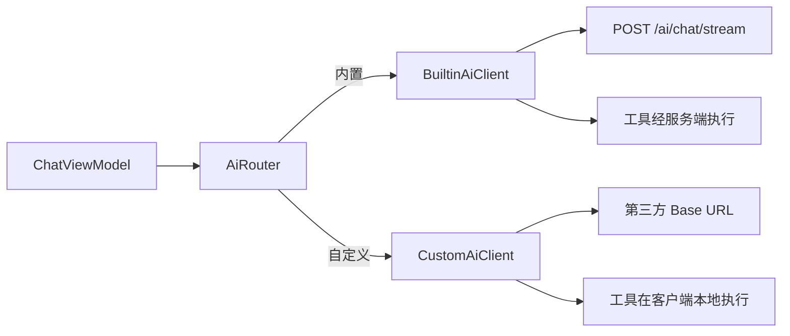
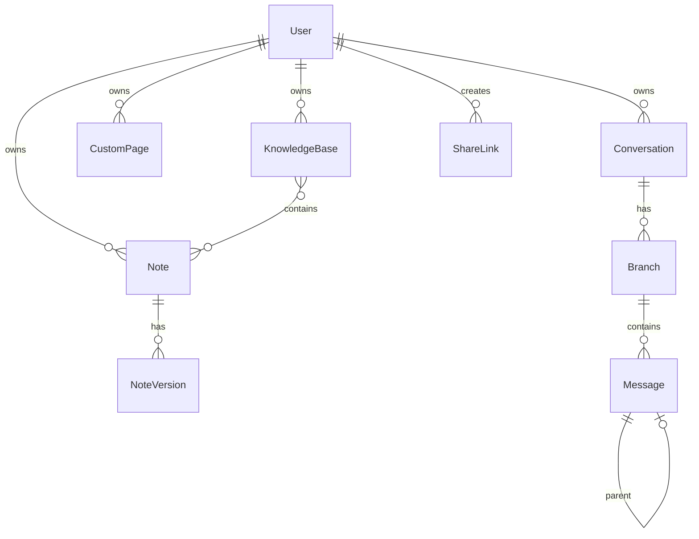

# MindShelf 技术架构

> 本文档基于 [需求分析](requirements.md) 编写，描述系统整体架构、模块划分、技术选型与核心机制。接口契约见 [api.md](api.md)。

---

## 1. 架构目标

| 目标 | 说明 |
|------|------|
| 离线优先 | 笔记、知识库等核心数据默认本地可用；云同步为可选能力 |
| 密钥隔离 | 内置 AI Key 仅存服务端；自定义 API Key 本机加密、不上云、不同步 |
| 可扩展 AI | 支持内置服务与客户端直连第三方 OpenAI 兼容 API；工具调用可读写业务数据 |
| 分支对话 | 消息树状组织，支持重新提问与分支切换（参考 DeepSeek / ChatGPT） |
| 分阶段交付 | 按 Phase 1 → 4 迭代，模块边界清晰、便于独立开发与测试 |

---

## 2. 系统上下文

```mermaid
flowchart TB
    subgraph client [Android 客户端]
        UI[UI / 导航]
        LocalDB[(本地 SQLite)]
        EncStore[加密存储<br/>自定义 API Key]
        STT_TTS[STT / TTS]
    end

    subgraph server [Flask 服务端]
        API[REST / SSE]
        SvcDB[(服务端 SQLite)]
        AIOrch[AI 编排 / 工具执行]
        Mail[SMTP 邮件]
    end

    subgraph external [外部服务]
        BuiltinAI[内置 AI API]
        CustomAI[用户自定义 AI API]
        Search[搜索 / 网页抓取]
    end

    User((用户)) --> UI
    UI --> LocalDB
    UI --> EncStore
    UI --> STT_TTS

    UI <-->|HTTP(S) 登录 / 同步 / 内置 AI| API
    API --> SvcDB
    API --> AIOrch
    API --> Mail
    AIOrch --> BuiltinAI
    AIOrch --> Search

    UI -->|HTTPS 直连 Key 不出本机| CustomAI

    Public((公开访问者)) -->|只读分享链接| API
```

### 2.1 通信路径

| 场景 | 路径 | 说明 |
|------|------|------|
| 内置 AI 对话 | 客户端 → 服务端 → 第三方 AI | Key 由服务端配置，客户端不持有 |
| 自定义 AI 对话 | 客户端 → 第三方 AI | 配置与 Key 仅存本机加密存储 |
| 业务 CRUD / 同步 | 客户端 ↔ 服务端 | JWT 鉴权；**生产 HTTPS，开发 HTTP** |
| 流式回复 | 客户端 ← 服务端（SSE）或 ← 第三方 API（SSE/ chunked） | 统一在客户端抽象为 `Flow<String>` |
| 公开分享 | 匿名 → 服务端 | Token 校验，只读 |
| 验证码 | 服务端 → SMTP | QQ 邮箱等，配置化管理 |

---

## 3. 逻辑架构

### 3.1 客户端分层

```
┌─────────────────────────────────────────────┐
│  Presentation（Compose UI + ViewModel）      │
├─────────────────────────────────────────────┤
│  Domain（UseCase / 业务规则）                 │
├─────────────────────────────────────────────┤
│  Data                                       │
│  ├── Repository（本地 / 远程统一入口）        │
│  ├── Local（Room DAO + SQLite）              │
│  ├── Remote（Retrofit API）                  │
│  ├── AiClient（内置 / 自定义双通道）          │
│  └── SecureStore（EncryptedSharedPreferences）│
└─────────────────────────────────────────────┘
```

**职责划分：**

| 层 | 职责 |
|----|------|
| Presentation | 页面、导航、对话分支 UI、流式文本展示、语音交互 |
| Domain | 笔记版本上限、回收站策略、同步合并触发、工具写操作确认 |
| Data | 持久化、网络、AI 通道切换、离线队列（同步 Phase 3） |

### 3.2 服务端分层

```
┌─────────────────────────────────────────────┐
│  Routes（Flask Blueprint）                   │
├─────────────────────────────────────────────┤
│  Services（业务逻辑）                        │
│  ├── auth / notes / kb / pages / share      │
│  ├── conversation / branch / message        │
│  ├── sync / trash / version                 │
│  └── ai（编排、工具、联网）                    │
├─────────────────────────────────────────────┤
│  Infrastructure                             │
│  ├── SQLAlchemy Models + SQLite             │
│  ├── Config（YAML / 环境变量）               │
│  ├── Mail（SMTP）                           │
│  └── Scheduler（回收站清理、验证码过期）      │
└─────────────────────────────────────────────┘
```

---

## 4. 技术选型

### 4.1 已确定栈（来自需求）

| 层级 | 技术 |
|------|------|
| 客户端语言 | Kotlin |
| 客户端 UI | Jetpack Compose（新功能采用；与现有 Gradle 工程集成） |
| 客户端本地库 | Room（SQLite 封装） |
| 客户端网络 | Retrofit + OkHttp + Kotlin Coroutines / Flow |
| 客户端密钥 | Android Keystore + EncryptedSharedPreferences |
| 服务端 | Flask (Python 3.11+) |
| 服务端 ORM | SQLAlchemy |
| 数据库 | SQLite（客户端、服务端各一份） |
| 内置 AI | OpenAI 兼容 HTTP API（服务端转发） |
| 邮件 | SMTP（当前 QQ 邮箱） |

### 4.2 架构阶段新增选型

| 事项 | 选型 | 理由 |
|------|------|------|
| 客户端架构模式 | MVVM + Repository + UseCase | 与 Android 官方推荐一致，便于测试与离线/在线切换 |
| 依赖注入 | Hilt | 管理 Repository、AI 通道、数据库等单例 |
| 导航 | Navigation Compose | 底栏固定页、对话、笔记等主导航 |
| 流式传输 | SSE（内置 AI）；自定义 API 按提供商协议适配 | 实现简单，与 Flask 兼容 |
| 鉴权 | JWT（Access Token + Refresh Token） | 无状态 API，适合移动端 |
| 密码存储 | bcrypt（服务端） | 行业标准哈希 |
| 验证码 | 6 位数字，Redis 或 SQLite 临时表，5 分钟有效 | 轻量，与 SQLite 栈一致时可落库 |
| 定时任务 | APScheduler | 回收站 30 天清理、验证码过期 |
| 自定义页面渲染 | **Schema 驱动 Compose 组件库** | 见 §9 |
| STT | Android `SpeechRecognizer`（Phase 2 首选） | 系统 API，集成成本低；无网络时提示能力受限 |
| TTS | Android `TextToSpeech` | 离线可用性较好，满足「一键播放 / 暂停 / 停止」 |
| 搜索 / 网页 | 服务端统一调用（内置 AI 路径） | 避免客户端暴露搜索 Key；便于来源标注 |
| 同步冲突 | 三路合并（automerge 思路 + 字段级冲突 UI） | 符合需求 SYNC-03 |

---

## 5. 客户端架构详述

### 5.1 模块划分（`app/` 包结构规划）

```
com.example.mindshelf/
├── ui/                 # Compose 界面
│   ├── chat/           # 对话、分支切换
│   ├── notes/
│   ├── knowledge/
│   ├── pages/          # 自定义页面
│   ├── settings/       # AI 提供方、同步开关
│   └── auth/
├── domain/
│   ├── model/
│   └── usecase/
├── data/
│   ├── local/          # Room Entity / DAO / Database
│   ├── remote/         # API 接口与 DTO
│   ├── repository/
│   ├── ai/             # BuiltinAiClient / CustomAiClient / AiRouter
│   └── sync/           # Phase 3
└── di/                 # Hilt 模块
```

### 5.2 本地数据库（Room）

客户端 SQLite 为**离线真相源（offline-first）**。未登录或关闭云同步时，所有读写仅触达本地库。

**与云端同步的实体**（Phase 3）：User 元数据、KnowledgeBase、Note、NoteVersion、CustomPage、Conversation、Branch、Message、ShareLink 元数据。

**不同步实体**：`AiProvider`（自定义 API 配置，含 Key）。

### 5.3 AI 双通道路由



| 通道 | 工具调用执行位置 | 联网搜索 |
|------|------------------|----------|
| 内置 | 服务端（访问服务端 DB） | 服务端 |
| 自定义 | 客户端（访问本地 DB；若已同步则与服务端一致） | Phase 2 可经服务端代理或客户端受限实现；优先内置路径 |

用户切换提供方时，`AiRouter` 仅更换底层 Client，UI 与消息存储逻辑不变。

### 5.4 对话分支（客户端 + 服务端一致模型）

**数据结构：**

- `Conversation`：会话容器。
- `Branch`：分支元数据（标签、根消息指针）。
- `Message`：`parent_id` 指向父消息，形成树；`branch_id` 标识所属分支。

**重新提问流程：**

1. 用户选中历史消息 `M`。
2. 以 `M` 的 `parent_id` 链为上下文，创建新 `Branch`。
3. 新用户消息作为 `M` 的兄弟节点（同一 `parent_id`），写入新 `branch_id`。
4. UI 展示分支列表 / 指示器，切换时按 `branch_id` 加载消息链。

删除会话时级联删除其下所有 Branch 与 Message。

### 5.5 离线编辑

- 写操作立即落本地 Room，UI 乐观更新。
- Phase 3 启用同步后：本地变更写入 `sync_queue` 表（实体 id、操作类型、时间戳、内容哈希）。
- 网络恢复或用户手动同步时批量推送；失败条目保留队列重试。

---

## 6. 服务端架构详述

### 6.1 目录结构（`server/` 规划）

```
server/
├── app/
│   ├── __init__.py         # Flask 工厂
│   ├── config.py           # 配置加载
│   ├── models/             # SQLAlchemy 模型
│   ├── routes/             # Blueprint
│   ├── services/
│   ├── ai/
│   │   ├── provider.py     # 内置 AI HTTP 客户端
│   │   ├── tools.py        # 工具定义与 dispatch
│   │   └── search.py       # 联网搜索 / 网页抓取
│   └── tasks/              # 定时清理
├── migrations/             # Alembic（可选）
├── config.example.yaml
├── requirements.txt
└── run.py
```

### 6.2 配置管理

通过 `config.yaml`（本地）+ 环境变量覆盖敏感项。提供 `config.example.yaml` 模板，**真实密钥不入库**。

| 配置项 | 说明 |
|--------|------|
| `ai.base_url` / `ai.api_key` / `ai.model` | 内置 AI |
| `smtp.*` | 邮件发送（当前 QQ 邮箱） |
| `jwt.secret` / `jwt.access_ttl` / `jwt.refresh_ttl` | 鉴权 |
| `share.base_url` | 公开链接前缀 |
| `trash.retention_days` | 默认 30 |

### 6.3 AI 编排（内置路径）

1. 接收客户端消息历史（当前分支上下文）。
2. 注入系统 Prompt（工具说明、知识库摘要策略）。
3. 调用内置 AI API；若模型返回 `tool_calls`，在服务端 `dispatch`：
   - 读工具：直接查 DB，结果回填模型。
   - 写工具：记录 `pending_confirmation` 或根据策略需客户端确认后再执行（见 §8.3）。
4. 流式 SSE 推送文本与工具状态事件。

### 6.4 公开分享

- 创建分享：生成随机 `token`，存 `ShareLink(resource_type, resource_id, revoked=false)`。
- 访问：`GET /s/{token}` 无需登录，只读返回资源快照或渲染数据。
- 撤销：`revoked=true` 后立即 404。

---

## 7. 数据模型

### 7.1 ER 关系概览



### 7.2 核心表字段

#### users

| 字段 | 类型 | 说明 |
|------|------|------|
| id | TEXT PK | UUID |
| email | TEXT UNIQUE | 登录邮箱 |
| username | TEXT UNIQUE NULL | 可选账号名 |
| password_hash | TEXT NULL | 验证码注册用户可为空 |
| created_at | INTEGER | Unix ms |

#### knowledge_bases

| 字段 | 类型 | 说明 |
|------|------|------|
| id | TEXT PK | |
| user_id | TEXT FK | |
| name | TEXT | |
| description | TEXT | |
| sort_order | INTEGER | |
| deleted_at | INTEGER NULL | 软删除，进回收站 |
| updated_at | INTEGER | 同步向量 |

#### notes

| 字段 | 类型 | 说明 |
|------|------|------|
| id | TEXT PK | |
| user_id | TEXT FK | |
| title | TEXT | |
| content | TEXT | Markdown 或纯文本 |
| deleted_at | INTEGER NULL | |
| updated_at | INTEGER | |
| sync_version | INTEGER | 乐观锁 / 合并基准 |

#### note_kb（多对多）

| 字段 | 类型 |
|------|------|
| note_id | TEXT FK |
| kb_id | TEXT FK |

#### note_versions

| 字段 | 类型 | 说明 |
|------|------|------|
| id | TEXT PK | |
| note_id | TEXT FK | |
| title | TEXT | 快照 |
| content | TEXT | |
| created_at | INTEGER | 每笔记最多 **10** 条，超出删最旧 |

#### custom_pages

| 字段 | 类型 | 说明 |
|------|------|------|
| id | TEXT PK | |
| user_id | TEXT FK | |
| name | TEXT | |
| schema_json | TEXT | 页面结构（Compose 组件树 JSON） |
| data_bindings | TEXT | 与笔记 / 表字段绑定 |
| pinned | BOOLEAN | 是否固定底栏 |
| deleted_at | INTEGER NULL | |

#### conversations / branches / messages

| 表 | 关键字段 |
|----|----------|
| conversations | id, user_id, title, created_at, updated_at |
| branches | id, conversation_id, root_message_id, label, created_at |
| messages | id, conversation_id, branch_id, parent_id NULL, role, content, created_at |

#### share_links

| 字段 | 类型 | 说明 |
|------|------|------|
| id | TEXT PK | |
| user_id | TEXT FK | |
| resource_type | TEXT | note / kb / page |
| resource_id | TEXT | |
| token | TEXT UNIQUE | URL 片段 |
| revoked | BOOLEAN | |
| created_at | INTEGER | |

#### ai_providers（仅客户端本地 Room 表）

| 字段 | 类型 | 说明 |
|------|------|------|
| id | TEXT PK | |
| name | TEXT | 显示名 |
| base_url | TEXT | |
| api_key_enc | TEXT | AES-GCM + Keystore |
| model | TEXT | |
| is_default | BOOLEAN | |

### 7.3 回收站

凡含 `deleted_at` 的实体，非 NULL 即视为在回收站。

- 恢复：置 `deleted_at = NULL`。
- 永久删除：物理删除或 tombstone 同步删除。
- **APScheduler 每日任务**：删除 `deleted_at < now - 30d` 的记录（含关联清理策略）。

---

## 8. AI 子系统

### 8.1 工具清单与映射

| 需求编号 | 工具名 | 操作 |
|----------|--------|------|
| TOOL-01 | `search_knowledge_bases` | 搜索 / 列出知识库 |
| TOOL-02 | `mutate_knowledge_base` | 创建 / 更新 / 删除 KB |
| TOOL-03 | `search_notes` | 搜索 / 读取笔记 |
| TOOL-04 | `mutate_note` | 创建 / 更新 / 删除笔记 |
| TOOL-05 | `mutate_custom_page` | 创建 / 修改页面 schema |

工具 schema 采用 OpenAI function calling 格式，服务端与客户端各维护一份一致定义（自定义 API 路径在客户端 dispatch）。

### 8.2 联网与网页（NET-*）

- **搜索**：服务端调用可配置 Search API（或 Tavily 等），返回标题、URL、摘要。
- **网页访问**：服务端 HTTP 抓取 + Readability 类正文提取，长度截断后注入上下文。
- **来源标注**：模型 system prompt 要求引用 `[标题](url)`；UI 渲染 Markdown 链接。

### 8.3 写操作安全

| 策略 | 说明 |
|------|------|
| 意图明确 | System prompt 要求删改前确认用户意图 |
| 可确认 | 客户端对 `mutate_*` 展示确认卡片（标题 / 摘要 /  diff 预览） |
| 可追溯 | 写操作写 `audit_log`（user_id, tool, payload, timestamp）— Phase 2 起 |

---

## 9. 自定义页面渲染（架构决策）

**决策：Schema 驱动的 Jetpack Compose 组件库。**

| 项 | 说明 |
|----|------|
| 存储 | `custom_pages.schema_json` 存 JSON 组件树 |
| 组件类型 | Phase 4 首批：`TodoList`、`Checklist`、`SimpleTable`、`TextBlock`、`NoteEmbed` |
| 渲染 | `PageRenderer(composable)` 递归解析 schema，映射到预置 Composable |
| 数据绑定 | `data_bindings` 指向 `note_id` 或本地键值；变更经 Repository 写回 |
| AI 修改 | 工具 `mutate_custom_page` 输出合法 schema；服务端 / 客户端校验 JSON Schema |
| 底栏 | `pinned=true` 的页面注册到 Navigation 底栏项 |
| 分享 | 公开链接返回 schema + 绑定数据快照（只读渲染） |

**不采用 WebView 的原因：** 避免任意 HTML/JS 注入风险，保持与 App 一致的 Material 风格，工具输出结构化 JSON 更易校验与 diff。

**扩展：** 若 Phase 4 后需复杂布局，可新增 `WebViewBlock` 组件类型，内容经 sanitizer 后隔离加载（后续迭代）。

---

## 10. 云同步与冲突处理

### 10.1 同步模型

- 每条可同步实体含 `updated_at`（及 notes 的 `sync_version`）。
- 客户端维护 `last_synced_at`  per user。
- 同步分两步：**Pull**（服务端 Δ since last_sync）→ **Push**（客户端 queue）。

### 10.2 三路合并（SYNC-03）

对单条 Note（其他实体同理简化）：

```
        base（上次同步共同版本）
       /                        \
  local（当前本地）          remote（服务端当前）
       \                        /
              merged
```

| 情况 | 处理 |
|------|------|
| 仅 local 变 | 采用 local |
| 仅 remote 变 | 采用 remote |
| 均变且字段不冲突 | 字段级自动合并 |
| 同字段均变 | 标记 conflict，UI 让用户择一或手动编辑 |

合并成功后递增 `sync_version`，写入新版本快照（触发版本历史上限逻辑）。

### 10.3 排除项

- `AiProvider` 不参与 sync。
- 已撤销 ShareLink 可同步 revoked 状态。

---

## 11. 安全设计

| 领域 | 措施 |
|------|------|
| 传输 | **生产**：全链路 HTTPS，OkHttp 默认证书校验；**开发**：客户端 ↔ 本机 Flask 使用 HTTP（见 §14） |
| 认证 | JWT；Refresh Token 轮换；验证码尝试次数限制 |
| 密码 | bcrypt；SMTP 授权码仅配置文件 |
| 内置 AI Key | 仅服务端内存 / 配置，响应与日志脱敏 |
| 自定义 API Key | Keystore 包装密钥 + EncryptedSharedPreferences；禁止备份（`backup_rules` 排除） |
| 多租户 | 所有查询带 `user_id` 条件 |
| 分享 | 随机 token ≥ 128 bit；只读；可撤销 |
| 工具写 | 确认 + audit_log |

---

## 12. 语音子系统

| 能力 | 实现 | 离线行为 |
|------|------|----------|
| STT（AI-07） | `SpeechRecognizer` + 可编辑文本框 | 依赖系统实现；无网络时在 UI 提示可能不可用 |
| TTS（AI-08） | `TextToSpeech` | 可离线播放已缓存回复；设置项：自动朗读开 / 关 |

权限：`RECORD_AUDIO`；首次使用引导说明。

---

## 13. 与非功能需求映射

| NFR | 架构应对 |
|-----|----------|
| 性能 | 本地 Room 索引（notes.title, updated_at）；列表分页；AI 流式 |
| 安全 | 见 §11 |
| 可用性 | 单 Activity + 底栏；核心路径 ≤ 3 次点击 |
| 可维护性 | 客户端 / 服务端模块对齐需求域；Blueprint / Repository 按功能切分 |
| 文档 | 需求 → 架构 → API 分层维护 |

---

## 14. 部署视图

| 组件 | 部署 |
|------|------|
| Android | Google Play / 侧载 APK；minSdk 24，targetSdk 36 |
| Flask | 单机或容器；SQLite 文件卷挂载；反向代理（Nginx）终止 TLS |
| 配置 | 环境变量注入密钥；`config.example.yaml` 文档化 |

**开发环境（HTTP）：**

| 项 | 说明 |
|----|------|
| 服务端 | `flask run --host=0.0.0.0 --port=5000`，无 TLS |
| 模拟器 Base URL | `http://10.0.2.2:5000` |
| 真机 Base URL | `http://<电脑局域网 IP>:5000` |
| 客户端 | **debug 构建**通过 `network_security_config` 允许上述域名/IP 明文 HTTP；release 仅允许 HTTPS |
| 自定义 AI | 仍走第三方 HTTPS，与本机 Flask 是否 HTTP 无关 |

**生产环境（HTTPS）：** Nginx（或同类反向代理）终止 TLS，Flask 内网 HTTP；客户端 Base URL 为 `https://...`。

---

## 15. 实施路线图

与 [requirements.md §6](requirements.md#6-实施优先级) 对齐：

| 阶段 | 架构交付物 |
|------|------------|
| **Phase 1** | Room  schema（notes, kb, conversation, branch, message）；Flask 骨架 + JWT 认证 + 笔记 / KB API；内置 AI SSE 对话 + 分支存储 |
| **Phase 2** | AiRouter 双通道；工具 dispatch；SecureStore；联网搜索；STT/TTS 模块 |
| **Phase 3** | SyncEngine + 三路合并 UI；回收站定时任务；NoteVersion；ShareLink |
| **Phase 4** | Page schema 校验 + Compose PageRenderer；底栏 pinned；页面分享 |

---

## 16. 相关文档

| 文档 | 说明 |
|------|------|
| [requirements.md](requirements.md) | 功能与非功能需求 |
| [api.md](api.md) | REST / SSE 接口 |
| [../CLAUDE.md](../CLAUDE.md) | 开发约定 |
| [../README.md](../README.md) | 快速开始 |

---

## 17. 修订记录

| 日期 | 说明 |
|------|------|
| 2026-06-15 | 初版：系统架构、选型、数据模型、AI / 同步 / 自定义页面渲染决策 |
| 2026-06-15 | 传输策略：开发 HTTP、生产 HTTPS |
